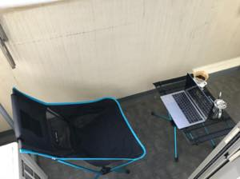

  
## リモートワークができるまで
それまでの間、弊社の若手は（というか一定期間？）リモートワークが禁止でした。  
理由は「成果物を出しづらいから」という理由だそうです。まあ、わからないまでもないけどさ・・・。  
じゃあ会社にいたら成果物なしでもOKだよね？というとそうでもないとは思います。  
~死ぬほどQiitaの記事漁ったりGolangの勉強してるんだけど・・・~     

## しばらくの間は自宅待機  
とりあえず（制度上）できない人は自宅待機をすることになりました。   
やることがあるのでたまに出社しましたが、それ以外はほとんど自宅にいます。  
おかげさまで、引っ越し直後からできなかった蒐集品の整理を行うことができました。  
このブログもこの時期に作っていので実は結構楽しんでいます（給料もでるし・・・）  
  
## ようやくリモートワーク開始
制度云々はさておいて、一気にリモートをするようになったので端末のライセンスが足りなかったようで、ようやくこっちにも回ってきたのでリモートワーク開始です。
会社だと音楽を聞きながら、なんてできないので自由気ままに環境を作れるのはいいなと思います。
（エンジニアってなぜかイケイケな音楽流すの好きですよね）  

## 気分転換に
### スタンディングで
  
基本的には自分のPCをおいている机でやっていますが、立ってできるようにカラーボックスの上にPC台を置くことにしました（自端末なのは会社の端末を写すとまずそうなので）
  
立ちながらやりたいときとかもあるので地味に助かっています。

### キャンプに行けないから
  
キャンプに行けない悲しみを補うために、晴れた日はマンションのベランダにそれっぽく置いて過ごすことにしています。  
いかにもいい雰囲気が出ているので、やる気なくすときに活用しています。
  
## リモートだとはかどりますね
いくら会社に近いとはいえど片道30分は消えますし、準備をする時間を含めるともっとかかります。  
在宅ならメール見ながらご飯食べれるし、余計な処理とかをさせている間に色々とできるので結構助かっています。 
寝間着のママだとオンオフがつかないので意図的に着替えるようにしていますし、気をつければ出社するよりもパフォーマンスを発揮できますね。 
  
・・・ちなみに午後一の仕事はその日に飲む酒を冷蔵庫にいれることです

参考  
[Twitter 自宅キャンプ](https://twitter.com/hashtag/%E8%87%AA%E5%AE%85%E3%82%AD%E3%83%A3%E3%83%B3%E3%83%97)