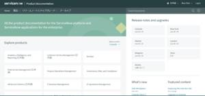

---
title: ServiceNow入門2:ServiceNowを扱う上でよく使うサイト達  
date: "2020-06-16T23:45:03.284Z"
description: "ドキュメントが少なく、ノウハウを蓄えるのにどうやって参考に構築をしていっているのか簡単にかいてみます"
---  
  
  
ServiceNowを取り扱う中で、あまり日本語でのノウハウなんてものがないので、
自分が何を参考にしながらいじっているのかをまとめてみました。  
  
  
## 公式ドキュメント
  
~~信用できるようで信用できない~~公式サイトのドキュメント集  
  
機能ごとに書いているので、何をどうしたいのかと言う場合はまっさきに検索をかけます。  
使用している型や関数なども記載されているので、スクリプトを書くなら必須です。
  
ただ、AWSのドキュメントみたいなのを期待すると、不親切な場所は多く、「これでどうしろと」みたいに思うことは多いです。  
あと、随分と前の中身を最新版のドキュメントに混ぜ込むのもやめてほしい。アップデートの意味がない。。。
  
リリースノートの確認によく使います。

https://docs.servicenow.com/

## コミュニティ
    
ユーザーコミュニティ。英語でやりとりをするという前提を除けば一番まともですね。
画像を載せてどうしたらいいかというのを多数の人とできるので、すぐに回答が来ることもあります。

https://community.servicenow.com/community

## Now Support (HI)
  
カスタマーサポートなので、契約している人向け。
日本語での質問も可能だが、反応は遅い。。。

どうやら日本語→英訳→海外エンジニアという流れになる場合もあるみたいで、
英語ができる人は英文で載せるほうが回答がはやいです。

回答までの遅さとか、正確じゃないときもあるので正直微妙。。。

https://hi.service-now.com/

## Qiita
エンジニア御用達のSNS。炎上すれども結局みんなここにたどり着く気がします。  
やっぱり情報が少ないのか、記事は少なめ。  
  
## まとめ 日本語のドキュメントは少ないです  
Google翻訳を使わない限り、公式ドキュメント以外はすべて英語に頼ることになってしまいますね。
こんなところで英語を使うことになるとは思っても見ませんでした。