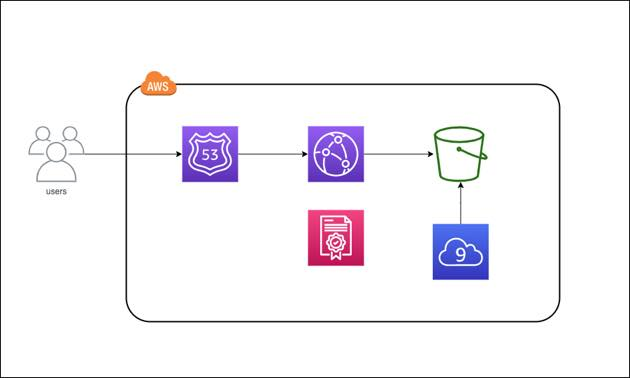

---
title: JAWS-UG 29 S3で静的サイトを公開しよう、のハンズオンをしてみて  
date: "2020-07-10T22:00:00.284Z"
description: "JAWS-UG初心者支部のハンズオンに参加？してみたのでちょっとまとめてみました"
---  
  
7/9にJAWS-UG初心者支部にて、S3を使ったハンズオンが行われました。  
その時に感じたこととかをざっとメモってみます。  
[AWS 上で静的な Web サイトを公開しよう！ハンズオン](https://jawsug-bgnr.connpass.com/event/179566/)  
  
## ハンズオンをやってみた感想
   
まずこのハンズオンはすでに公開されているAWS Hands-on for Beginnersのハンズオンからかなり簡略化されたものになります。
[AWS 上で静的な Web サイトを公開しよう！](https://pages.awscloud.com/JAPAN-event-OE-Hands-on-for-Beginners-StaticWebsiteHosting-2020-reg-event-LP.html?trk=aws_introduction_page)

このようにhttpsにしてR53で名前解決をしてからCloudFrontを経由してS3内のページを公開するるのですが、ハンズオンでは（デモを除いた場合）S3のバケットに直接アクセスする形式を取っています。  
  
質問や解説を含めるとこれぐらいが確かにちょうど良いのかなって思いました。  
ハンズオン自体はまったくわからないところから見ながらやると30分はかかるかと思います。  
  
コードを丸コピする準備が出来てたり、すでにやったことある場合はもっと短縮できます。  
やってみましたが、Cloud9の環境構築を待っている時間が割と長く感じるぐらいです笑  
  
HTML,CSSはほとんど手つかず状態で勉強していないので、遊べる環境が手に入ったと喜んでおります。  
  
## LT
1人目はAWS S3のマニアックなサービスについてです。  
気がついたらS3のサービスが増えていたり、全く使ったことのない機能などなどが出てきており、
随分と奥の深いサービスだなあと感じました。  
好きなサービスはS3と公言しちゃったため、今回の資料はせめて読み込もうと思います。  
  
S3のデータの整合性に関してはSAAの資格取得のテキストにも書いていましたが、複数のデータセンターを用いた耐久性を担保するためというのは初めてしりました（もしかしたら書いていたかもしれませんが）  
  
2人目はCloud9やChimeなどのサービスを使ったリモートでの新人研修についてでした。実は人数制限があるとか結構たいへんだったという話を聞けてよかったです。  
意外だったのは画面共有しているので、表情が見えない代わりにマウスカーソルがくるくる動いていて、「ここで悩んでるんだあ（でも違うし）」というのが見えてきたという部分です。  
  
自分の時も研修の時はPCを持っていって聞きに行ってましたが、リモートで見るほうが早めにアドバイス出来たのだろうなあと思いました。  
  
## オンライン勉強会の司会をはじめてやってみて
  
実はわたしは初めと終わりの司会でした。本当はもうちょっとうまく話すつもりでしたが、最初はそうも行かずという状態でした。  
  
一番の理由はNWの接続がとぎれとぎれになっており、そこであたふたしておりました。  
WiMAXにしてたのに、最終的には楽天モバイルの回線を使うというなんともわけのわからない状態でした。（[自分のブログ](https://www.motsu-tanbou.com/entry/rakutenmobile_mini) にて微妙かもって言ってたのに）  
接続確認のときにはよかったのですが、何ででしょうね。。。。  
  
他の勉強会の司会をしたり、オンラインでの様子は（撮影している隣から）何度も見ていますが、顔が見えないというのは確かにやりづらいですね。チャットで少しでも反応してくれるというのはありがたかったです。  
  
## まとめとか  
オフラインでの勉強会が段々復活しているみたいですが、オンラインならではの強みもありますよね。  
S3のCLI操作などもうちょっと深く勉強していきたいです。  