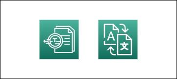
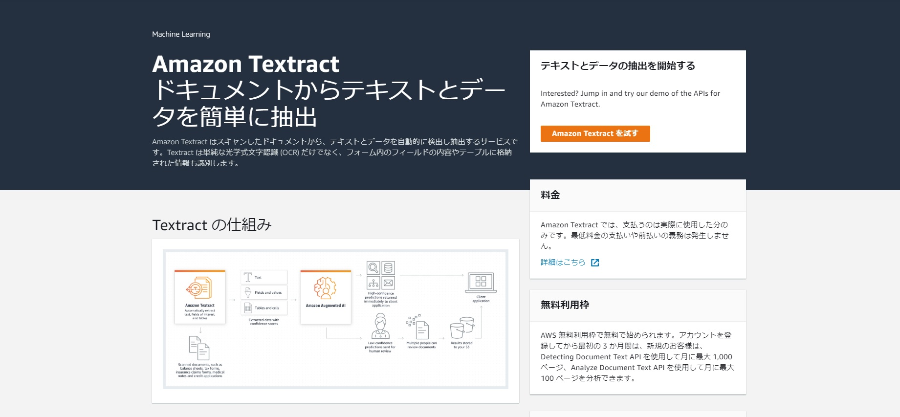
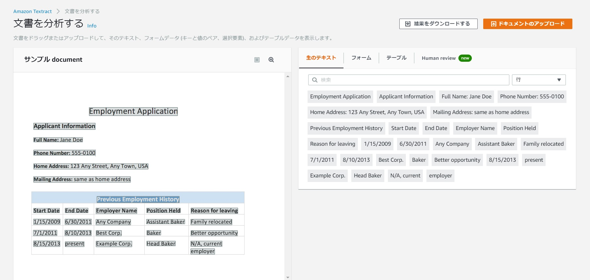
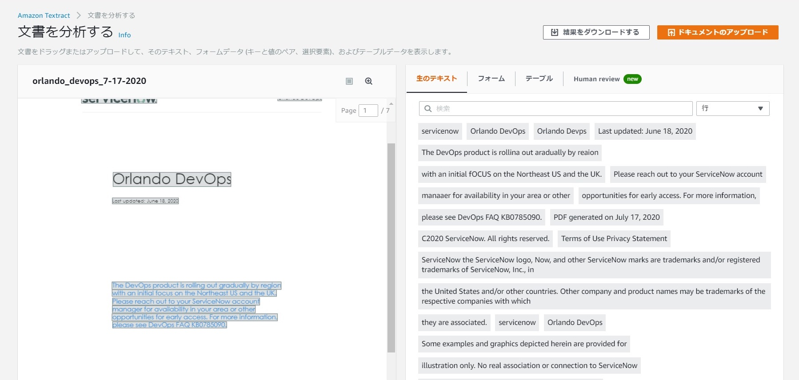
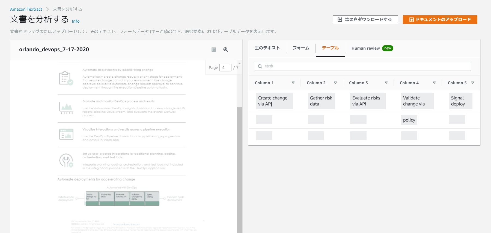
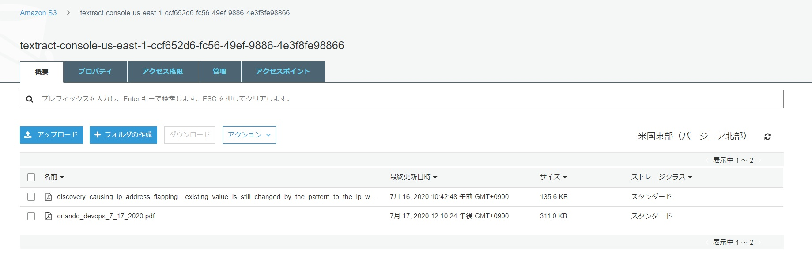
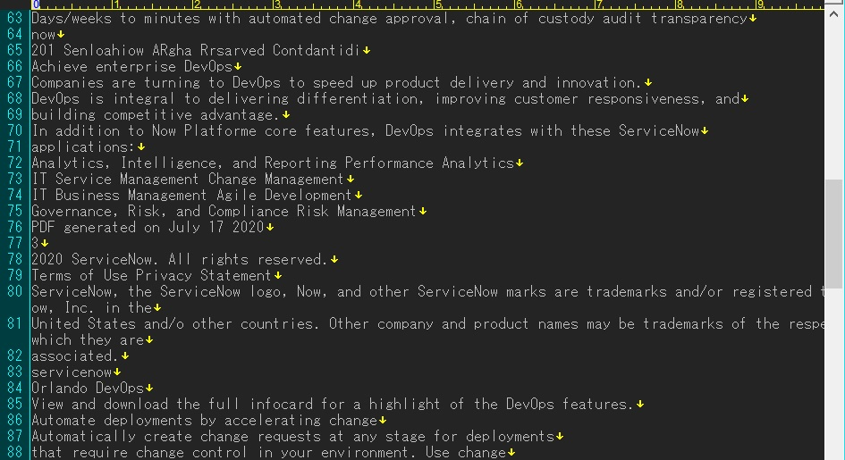
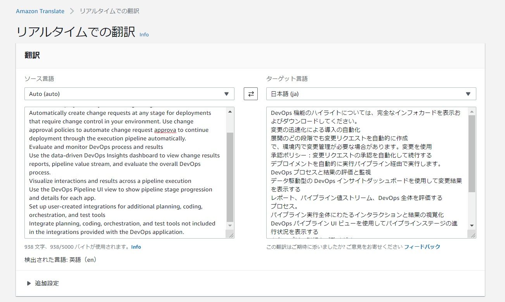

  
文字起こしという機能をクラウドで実装する方法をちょっと考えてみました。実際に実現できていないのが課題なのでそこはやろうと思います。  
意外とできそうなできなさそうなというところで詰まりました・・・。
  
## 特に問題がないならGoogle翻訳かGoogleドキュメントの使用でOK
個人の環境であれば、Google翻訳やGoogleドキュメントでPDFをアップロードする、というのが一番ラクで精度が高いように思います（Google翻訳は微妙な部分もあっって、DeepLの方がいいときもありますが）  
  
ただ、職場によってはこれらのサイトを使えないこともあります。クラウドならばOK（駄目だけど、ごまかせる）という場合もありますので、機能単体ですが、少しいじってみました。

## Amazon Textractで文字起こし
画像やPDFをはじめ単純なOCR以外にもテーブルなどの情報を持ってくることが可能です。
 >実質的にどのドキュメントからでもテキストやデータを簡単に抽出

機械学習も使用しており、コードを使用することもなく簡単にできそうです。 
2020年7月現在でのデメリットは以下の2つです。
 * 東京リージョンでの使用不可  
 * ___英語等のみで日本語化は不可___
  
結構大きいデメリットですね・・・。リージョンはまだしも日本語化出来ないのがきついです。
あとPDFは10Pまでって結構使い勝手悪そう。

とりあえず試してみます。

  
AWSのコンソールにログイン後、Amazon Textractと入力して画面に遷移します。  
右側の「試してみる」を押して画面に飛びます。  
  
  
サンプルのドキュメントが先に表示されています。  
生のテキストはそのままの文章を、テーブルは別途で出力されるようになっています。  
  
画像形式で公開されているデータを引っ張ってくるには使いやすいと思います。  
右上の「アップロードする」を選択するかドラッグ・アンド・ドロップでファイルをアップロード出来ます。  
画像の場合は特になにもないのですが、PDFの場合はS3にバケットを作成することになります。  
今回はServiceNowのドキュメントを翻訳させてみましょう。  
  
[Orlando DevOps](https://docs.servicenow.com/bundle/orlando-devops/page/product/enterprise-dev-ops/concept/dev-ops-bundle-landing-page.html)  
  
## 文字起こしの結果  
  
見た感じだといい具合に翻訳されていました。  
  
  
テーブルも別途出力されていますね。  
  
  
S3のバケットにはもとのPDFがアップロードされています。    
結果のダウンロードでファイルを出力します。 
  
  
うーん、きちんとテキストデータに落とせているのはいいのですが、勝手に改行されているので、なんとも読みづらいです。  
一部文字が大文字になっていたり記号になっていたりと精度はまあまあなようです。  

## Amazon Translateで翻訳をしてみる  
こちらはAmazonが提供する翻訳サービスです。深層学習モデルを使用しているので割と正確に出るみたいですね。
 > 高速で高品質な言語翻訳を手ごろな価格で提供するニューラル機械翻訳サービスです。ニューラル機械翻訳は、深層学習モデルを使用して、従来の統計ベースやルールベースの翻訳アルゴリズムよりも正確で自然な翻訳を提供する言語翻訳自動化の一形態です。
  
[Amazon Translate](https://aws.amazon.com/jp/translate/)  

  
単体で使用する場合は、コンソールからAmazon Translateを選択してボックス内に文をいれるだけになります。使い方は翻訳サイトとほとんど同じですね。  
翻訳の精度はまあまあのようです。試しに違う文をAmazon Translate、Google翻訳、DeepL翻訳で比較してみましたがほとんど同じでした。  

## まとめ：短文のを翻訳するぐらいならすぐに使えそう  

書いている時点では作っていないのですが、
1. S3に対象のPDFをアップロードする
2. アップロードのタイミングでTextractを起動するようにLambdaを設定
3. Textract終了後をトリガーにTranslateを起動してS3のバケットに保存

みたいな感じで実装できそうです。文字の微妙な改行などはSageMakerとかを間に挟むことで解決できるかもしれません。  
AWSは万能かなと思っていましたが、思わぬところに制約がありますね。ちょっと意外でした。

## 参考  
[音声を文字起こしする](https://aws.amazon.com/jp/getting-started/hands-on/create-audio-transcript-transcribe/)  
[Amazon Textract を使用したドキュメントからのテキストと構造化データの自動抽出](https://aws.amazon.com/jp/blogs/news/automatically-extract-text-and-structured-data-from-documents-with-amazon-textract/)