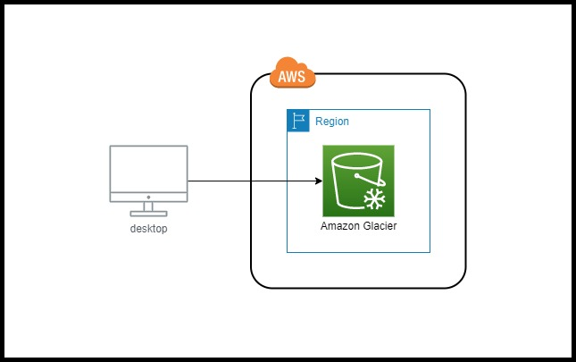  
趣味用のブログで、AWS Glacier Deep Archieveが写真用のアーカイブ・ストレージとして使えそうという内容を書いてみました。ここでは少し内容を詳しめに書いてみようと思います。

## TL;DR  
有名なパブリッククラウドをまとめて紹介しようとしたら大変なことになったので分けて紹介することにしました。AWSはGlacierがS3の一部となったのですげえ使いやすくなりましたというお話です。  
**すばらです。**  
あとタイトルは恋する小惑星を参考にしてみました。

## AWS Glacierとコスト
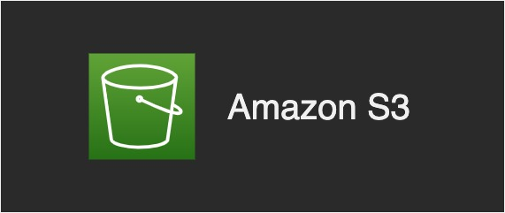  
AWSのストレージサービスで、耐久性はS3と同じイレブンナインのストレージサービスで、アクセス頻度の低いもの、アーカイブとして使用できるクラスが存在しています。  
取り出しの時間によって料金も変わるのですが、迅速に取り出しをしたい場合は緊急以外はないですかね。  
かつては通信によって料金が変わるという性質のため、高額な料金がかかる可能性もありましたが、今は規定の金額が設定されています。
  
名前の由来はデータを氷漬けにするから氷河から来ているようです。私は個人的にお気に入りのネーミングです。（元々氷河をやっていたので）  
コストは最も安い米国で試算をします（2020年8月現在）。
  
米国（北カリフォルニアを除く）  
 - S3低頻度アクセス:0.0125USD/GB
 - Glacier：0.004USD/GB
 - Glacier Deep Archieve：0.00099USD/GB
額になおすと25ドル・8ドル・1.98ドルとなります。
Glacierそのものは他と金額が大差ないのですが、Glacier Deep Archieveだけは1/2までコストが下がっています。  

ちなみに東京リージョンだとこんな感じです
 - S3低頻度アクセス:0.019USD/GB
 - Glacier：0.005USD/GB
 - Glacier Deep Archieve：0.002USD/GB
額になおすと38ドル・10ドル・4ドルとなります。
  
## ハンズオン
実際に保存をしてみます。GUIでできるのが便利ですね。  
  
### S3のコンソール画面から新規バケットを作成する  
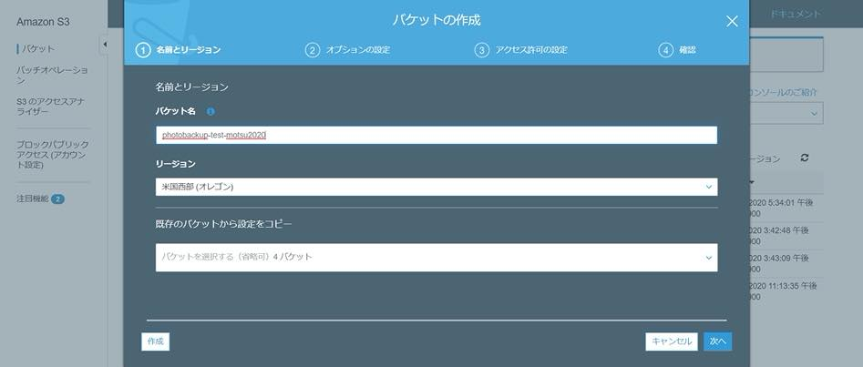
ここではテスト用に使用するので「test」みたいなのを名前につけます。  
S3のバケットは世界で単一の名前にしないといけないので単純な名前だと弾かれます。
  
普段でしたらリージョンは東京を選択しますが、上記の通りものすごく安いので米国のを使用することにします。  
基本的にはどこでもいいのですが、米国西部：北カリフォルニア（us-west-1）のみ$0.002/GBなので注意が必要です（東京と同じ金額なのでレイテンシを考えると全く選ぶ必要がない）。今回は米国西部：オレゴン（us-west-2）を選択します。   

us-eastを選ばなかったのはデータセンターが逝く回数があまりに多いので避けました。  
[AWS でいままで起きた大規模障害を振り返る](https://qiita.com/saitotak/items/07931343bcb703b101f8)

IAMのロールなどは面倒なのでadminを付与したもので作業をしています。  
公開範囲などの設定を求められますが、そこまでの使い方をするわけではないので、今回は全部無視します。  
スキップしまくると無事にS3バケットが作成されますので、このままGlacierへアップロードしていきます。  
  
### ファイルをGlacierにアップする
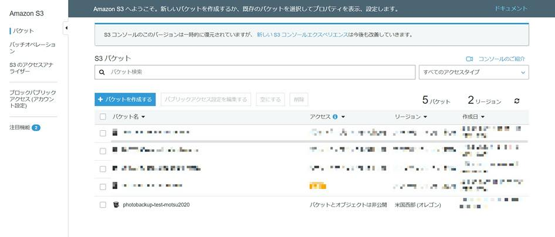
バケット内でフォルダを作成します。今回はGlacierのテストなので適当なフォルダ名にします。  
  
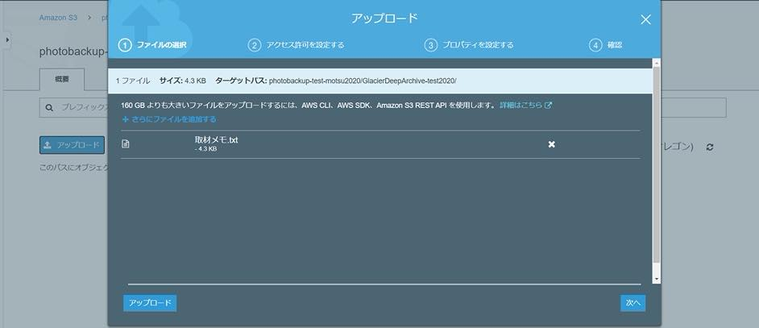
アップロードはドラッグ・アンド・ドロップで出来ますので、適当なファイルを入れます。  
写真の場合は日付でリネームしたzipファイルだと後々管理が楽かなと思います。  
  
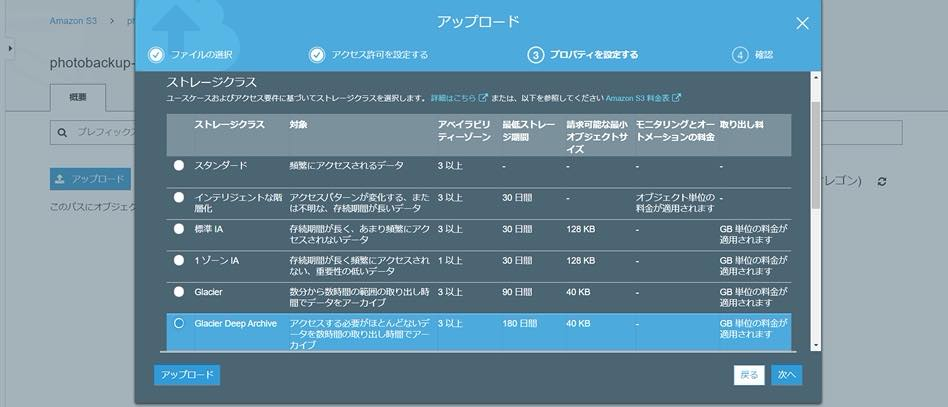
アップロードするときにストレージクラスを選択します。  
今回はアーカイブの中でもほとんど取り出さない設定なのでGlacer Deep Archieveを選択します。  
もしS3の低頻度にしたり、Glacierにしたい場合はここで設定できるのでかなり便利だと思います。  
  
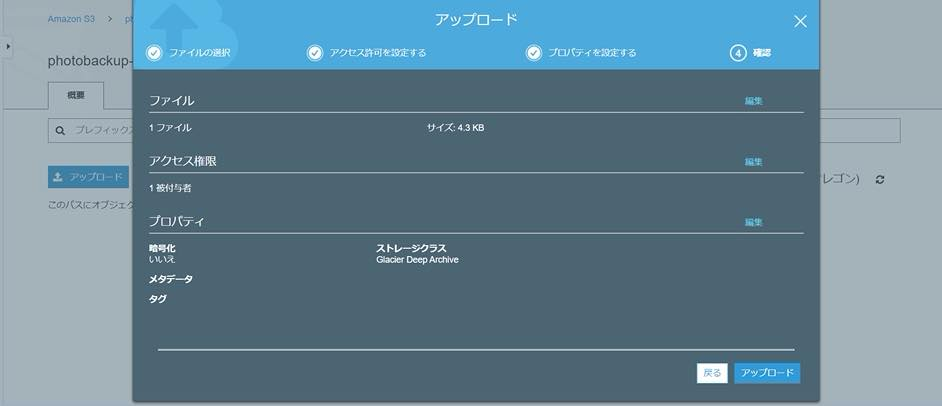 
そのままアップロードを押すとファイルがアップロードされ、これで完了になります。
  
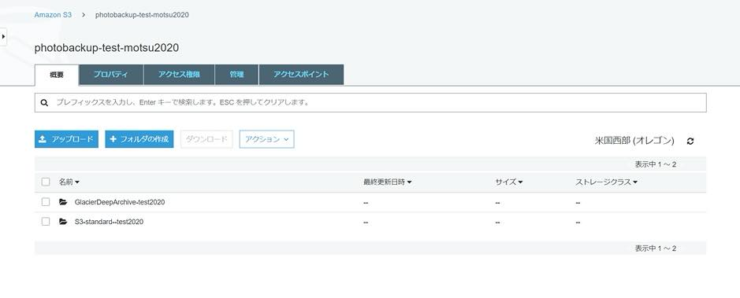
バケットに戻るとちゃんと作成されていますね。
  
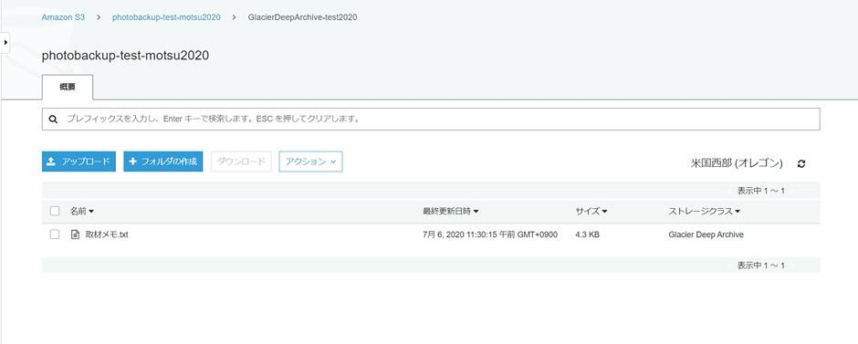 
ストレージクラスもちゃんとGlacer Deep Archieveになっていますね。 
  
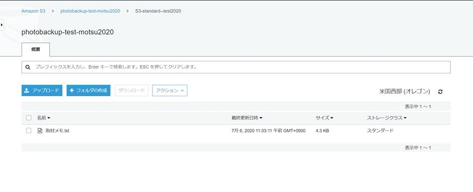 
今のテスト環境のバケットです。S3の標準でも同様に作成をしてみました。  
中身を確認するとストレージクラスがスタンダードになっています。  
  
### 保存したファイルをダウンロード（復元）する  
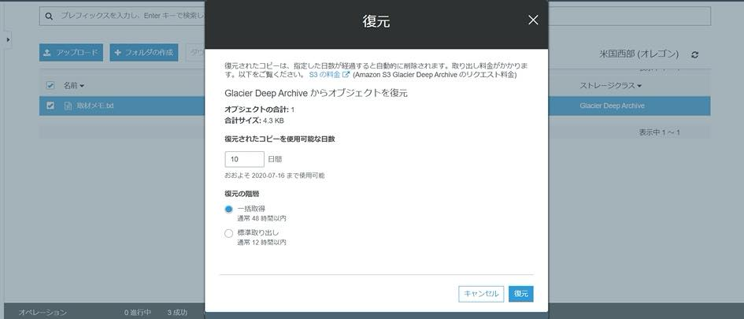 
Glacierからファイルの復元依頼を出します。  
即時でダウンロードできないので、アクションの「復元」を選択し、何日ほど使用可能にするのかを設定します。この日は適当でも問題ないです。  
あとは取り出しにかかる時間を待つだけです。最大2日も待てばいいのであとは気長に待ちましょう。   
  
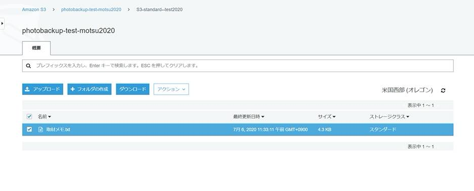 
ちなみにS3の標準だと即時でダウンロードが出来ます。もちろんその分の料金はかかるので使い方によって分けましょう。  
  
## まとめ
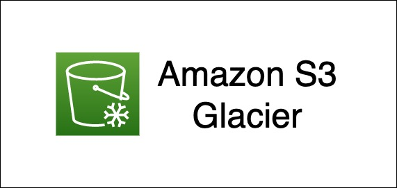  
これまでCLIで保存をしていたGlacierですが、GUIに対応することによってだいぶ使用にハードルが下がっていますね。料金も比較的安く、年間3000円で確実に保存できることを考えると個人使用としても現実的かなと思っています。  
次はMicrosoft Azure Storageを紹介します。
  
## 参考
[Amazon S3 の料金](https://aws.amazon.com/jp/s3/pricing/)  
[AWSのS3 Glacierを使って写真のバックアップをしてみる](https://www.motsu-tanbou.com/entry/aws-s3-glacier-photobackup)  
まあ、2つ目は僕のなんですが・・・。