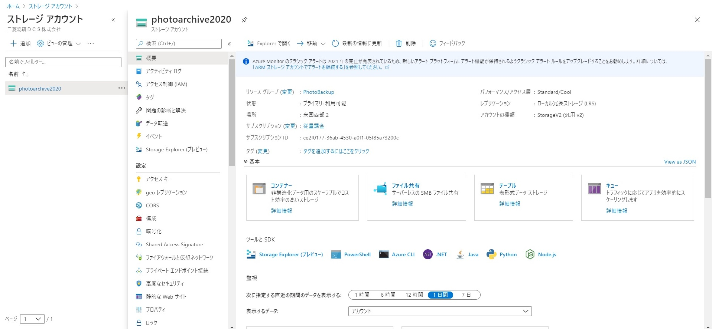

  
パブリッククラウドのアーカイブで写真を保管するの第二弾はMicrosoft Azureです。  
実際に操作してみるとAWSとは違った特徴が出てきて面白かったです。

## Azure Archive Storageとは  
Microsoftが提供するAzureのStorageになります。  
AzureはStorageの使用頻度に合わせてHot, Cool, Archiveの３種類が提供されています。  
色々ありますが、Amazon S3との比較なのでストレージタイプはBLOBで固定します。  
ホットは頻繁にアクセスを行う、クールは30日以上保管する、アーカイブは180日以上というように書かれています。  

一方で冗長性を以下のどれかから選択することが出来ます。  
 - ローカル冗長ストレージ (LRS)
→持続性が99.999999999%。1つのデータセンターで３回のコピーを作成。  
 - ゾーン冗長ストレージ (ZRS)
→持続性が99.9999999999%。複数のデータセンターで管理をします  
 - geo冗長ストレージ(GRS)
→持続性が99.99999999999999%。別のリージョンでも3回コピーされる。  
 - geoゾーン冗長ストレージ(GZRS)
→GRSではプライマリのデータセンターに３つのコピーを取りますが（LRSと同じ）、
GZRSでは３つのデータセンターに１つずつコピーを取る方式（ZRSと同じ）です。
セカンダリはどちらもLRSと同じです。

１つのセンターに保存するのに、3つのAzに保存するS3と同じ耐久性ってなんだろう。
一応S3 one zoneも同じ耐久性を保証していますが、この辺の差をどうやって出せるんでしょうね。

### 料金形態
AWSと同じく、日本と最安のリージョンで比較します。
日本の東日本・西日本リージョンでの値段はこうなります。  
 - ホット：2.24円/GB(最初の50TBのみ)
 - クール：1.68円/GB
 - アーカイブ：0.224円/GB  

2TB使うと想定するとそれぞれ4480円、3360円、448円ほどになります。

料金は一番安いのが米国西部２・米国中北部・米国東部です  
 - ホット：2.0608円/GB(最初の50TBのみ)
 - クール：1.12円/GB
 - アーカイブ：0.11088円/GB  
 
同じく2TB使うと想定するとそれぞれ4121円、2240円、221円ほどになります。
ちなみに最安の値段は0.00099ドル/GBとAWS Glacier Archiveと同じ値段になりますが、
ホットの値段はAmazon S3標準よりも安いんですね。

絶対になくしたくないようにGZRSでクールにすると2.52円/GBと倍になります。

## ハンズオン
### ストレージアカウントの作成  
  
まずはじめにポータル画面からストレージアカウントを作成します。  
Azureサービスに表示されていますが、なければ検索画面から検索して選択を押します。  
  
  
この段階ではストレージアカウントが存在していませんので、新規作成をします。
  
  
作成を押すとこの画面に飛びます。リソースグループもないので新規作成をします。  
アカウントの場所は一番安い米国西部2を選択しましたが、 他でも問題ないですん。   
アカウント名は大文字と記号が使用不可、一意のものになるように名前をつけます。  
パフォーマンスは標準、レプリケーションは一番安いLRS、アクセス頻度はクールにします。  

   
アカウント作成後、画面のように表示されます。ここからでもいいのですが、Explorerで開くを押して、Storage Explorer画面に遷移させます。  
  
### Storage Explorerで保存   
  
画面からBLOBコンテナを選択して、右クリックでコンテナの作成を押します。コンテナ作成後はアップロード選択ができるようになるので他と同じ用にアップロードして終わりです。  
この段階ではアカウントで作成したクールの状態でしか保存されていないので、アーカイブに変更します。  
  
### アクセス層の変更  
  
この画面に表示されているBLOBを選択し、プロパティを選びます。  
そこからアクセス層を選択するとホット・クール・アーカイブを選択できるので、アーカイブを選んで保存すると無事にアーカイブで保存されます。  
一度保存したBLOBファイルのアクセス層を後から変更できるのは大きいですね。  
  
## まとめ：絶対になくしたくないならAzureがありかも  
最安値はAWSと同じですが、課金をすればAWS以上に耐久性の高い保管が可能になるのが面白いですね。
Storageアカウントを作成したり、コンテナに入れたりとGUI上での操作はAWSのほうが楽かなーという印象でした。  
  
最後はGCPを取り上げます。

## 参考
[Azure Blob Storage: ホット、クール、アーカイブ ストレージ層](https://docs.microsoft.com/ja-jp/azure/storage/blobs/storage-blob-storage-tiers?tabs=azure-portal)