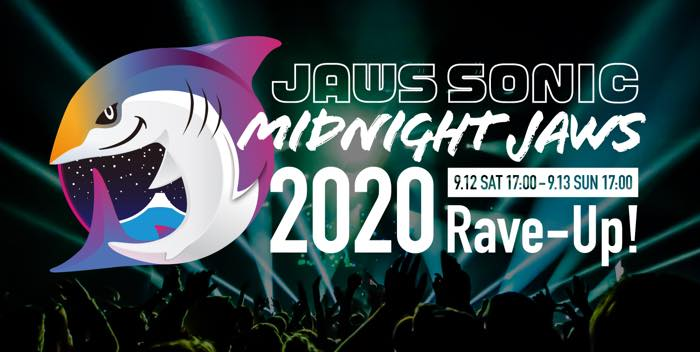
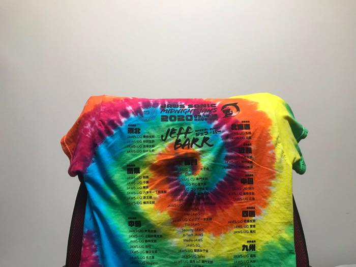

JAWS-UGのオンラインイベント「JAWS SONIC」があったので、頑張ってできるだけ参加してみました。技術的なことはあまり書いてないので感想という位置づけです。  
楽しかったのですが、翌日は睡眠不足で常に眠いを連呼してました・・・。  

## JAWS SONIC 2020と意気込みと現実
  
２４時間のオンラインイベントを全部レポートにしたら面白いんじゃないか、そう思っていた時間もありました。  
気になったことはメモやスクショを撮りましたが、途中で「ああ、全部やるのは無理だなー」と諦めました。  
QuickTimeの機能を使えば録画をできなくもないですが、
 -  絶対にみかえさない長さ
 -  オンタイムで見るからこその魅力
 -  安心感からかつい寝てしまう、ということの逃げ道の封鎖  

からやめることにしました。今思えばこれは正解でしたね。  
その場で感想をTwitterに投げられるのは勉強会に参加しているからこそであって、アーカイブだと面白くないですし結構頭に入れられました。  
  
さて、当日はどれぐらい起きれたのか、寝ていた時間を観てみましょう。  
 - 05:00-07:20
 - 13:00-15:00  
→合計：4:20  
  
うーん、意外と寝ていましたね。前日も同じような睡眠時間でしたし、なんならOPは群馬から電車内で聞いてましたので、意外と持ったほうだと思います。  
ちなみに時間は自分の聞いていないセッションの項目をタイムテーブルから洗い出しました。時間管理もできる優秀なプログラムですね（白目）  
  
[jawssonic2020](https://jawssonic2020.jaws-ug.jp/)  

## セッションの感想  
全部書こうと思って意気込んだのはいいのですが、上記のとおり、無理だったので適当な感想でお茶を濁したいと思います。  
  
### 支部の紹介  
とりあえずダラダラと鹿児島支部とか関西女子会とかが当てはまりますね。タイトルで出ていなくてもそれぞれの支部の紹介があるので、  
「あ、この支部ってこんなことしていたのか」みたいなのを聞くことができるのは最大のメリットだったと思います。  
オンラインになってから物理的にいけなかった支部に参加できるようになったのはコロナ禍の数少ないメリットですね。
  
### サービスの紹介  
MediaServicesやKinesis Data Streamなど特定のサービスを使ったという内容です。普段自分ではいじらないようなサービスについての紹介もしれくれたので、  
この後にドキュメントとかを読むとすっと頭にはいってきました。
  
### AWSで構築した話
サービスを特定して紹介するのではなく、様々なサービスを組み合わせたという事例紹介です。  
サービス紹介をしている支部でも紹介していたのでこれは全体的な話ですね。こういった構成でつくったのかーと資格の参考書だけだと見れない構成がたくさんでした。  
業務で使用しているのもあるので、なかなかおもしろい話ばかりでした。
  
### 深夜枠  
パワポカラオケからはじまり、ビブリオバトルとLT枠でもやれない（？）ようなことをしていました。ビブリオバトルはうとうとしながらなのでもう記憶にございません。  
パワポのスライドの３枚目はネタだったのですが、どこからこれを持ってきたのかすごく気になりましたし、無理難題（？）な絵をみながらAWSと結びつけたスピーカーはすごかったです。
  
### 中の人関係  
JAWS愛を語るやお気に入りのサービスなどですね。  
ユーザーだけでなく、AWSの中の人から直接話しを聞けるのは貴重な機会でした（亀田さんのは寝落ちして聞き逃しました・・・）  
深夜の電話についてはテレフォンショッキングみたいな感じで面白かったです。時間さえあればもっと聞いてみたい内容でした。
  
### JAWS-UG全般  
コミュニティマネージャからみたJAWS-UGやJeff Barrのセッションがそれにあたりますね。  
JAWS-UGのこれまでの活動の歴史を写真などを使って見ることができました。  
新参者(?)からすれば歴史を振り返るいい機会になりました。
  
## 他にもたくさんありました  
とある南の島からのお話、料理や結婚に例えたプレゼン方法等など、支部ごとに書かないとまとめられない個性的なセッションが多く、
これほど聞いていられるオンライン配信もなかなかないなーと思います。どれかは自分の業務に関わる部分もあるので、そういった部分はかなり刺さりました。  
ちなみに自分はOpsJAWS支部の監視の部分がかなり刺さりました。データの解析できると転職でも有利になれるんですねー、良いこと聞いた.  
それぞれ流れている感想も面白く、togetterでのまとめは読んでて笑いそうになりました。  
[JAWS SONIC 2020 Day1](https://togetter.com/li/15914646)  
[JAWS SONIC 2020 & MIDNIGHT JAWS 2020 MIDNIGHT](https://togetter.com/li/1591535)  
[JAWS SONIC 2020 Day2](https://togetter.com/li/1591766)  
  
これだけ多くのAWSサービスを一気に聞ける機会なんてないですし、参加できた人はラッキーだったのではないかって思っています。  
興味のある支部もいくつか見つけられたので早速参加をしに行こうと思います。~転職専門支部は興味あります~  
  
## おまけ：JAWS SONICと私  
  
運営スタッフとしては全くといっていいほど関わっていませんが、某支部の運営メンバーではあるのでちょろっとやったぐらいです。  
それもセキュリティの柱を読んだのと５秒の動画を投稿したレベルです・・（下記動画にちょろっと出ています）  
  
HNしか伝えてない人は本名モロバレですねw  
  
特にやってない以上、せめてTLはもりあげようかなーという思いで参加をしていました。  
結果的に自分が一番楽しめて、勉強になりました。運営メンバーをやるときはいつも思っているのですが、１参加者としてよりも深く理解できる機会が多いのでおすすめしてます。  
弊社の人間は運営はおろか、このイベントにすら参加してないだろうという自信（？）があるからやりたい放題にやれてます。嬉しいような悲しいような気もしますが。  