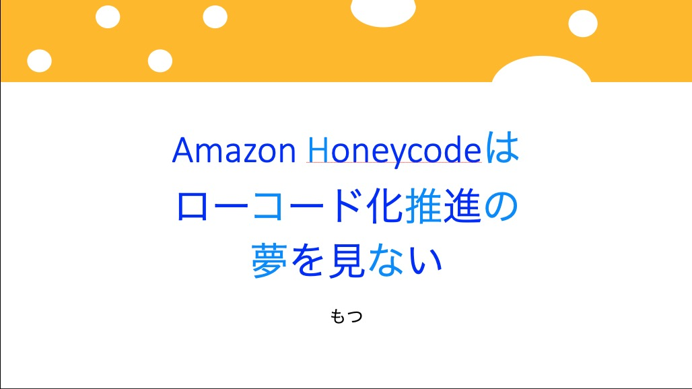

## 接続が悪くて正直ドッキドキだったあの日  
接続がプッツンプッツンで実は緊張していたのはそんな理由でした。  
２回ほど接続きれてそれどころじゃなくてギリギリに復帰できたのでもう緊張がやばかったです。  
おいこらWiMAX...  

## ちょっとした前提  
ServiceNowを触るという前提があるので、どうしても判断基準がそこになってしまうので、ご了承ください。

## 改めてHoneycodeを触った時の感想とか  
さて、今回のLT用に触ったのは資産管理を行うテンプレートを使用しました。
会社の端末の資産管理をエクセルとかで行わなくてもいいようにという目的があります。  
実際にテンプレでしか軽く触っていないのですが、シートに項目を追加していけば細かく管理ができるということがわかりました。  
  
LTでも話しましたが、SaaS側の用意するポータルサイトを下手にいじくって面倒なことになるよりも、フルマネージドなHoneycode側でUIをいじるほうが安全です。  
顧客でも結構カスタマイズを要求されそうな場面でもこれならいける、と思っちゃいました。
  
## AppFlowを初めて知って  
実は今回始めて知ったサービスです。SaaSとAWSのサービスをつなげるということをそもそも念頭においていなかったです。  
（ServiceNow内で解決するという感じだった）  
  
さて、本格的に触っていないのですが、今回はマッピングを適当に振ったので、シートへの連携があまりきれいになっていなかったです。  
というのも、そこまでするのが今回の目的じゃないのは触っている途中で気づきました。。。
  
実は本当に見たかったのはどこまでの連携が可能なのかということです。見てみるとお目当てのログファイルをS3に入れられることが判明しました。  
このServiceNow内でもログは保管できるのですが、一定期間以上にするのはよくないらしく、外部に保存先を求めていたんです。  
AppFlowで直接つなげてしまえばログを長期間保管できますし、いわゆるベストプラクティスを守ることができる、というのはありがたい話です。  
  
## AppFlowがもたらしてくれるメリット  
ServiceNowでは外部ツールとの連携にMIDサーバーという別途サーバーを建てる必要があるのですが、これがまた面倒なもので。。。  
単純にメンテ対象が増えるのと、連携のために色々設定を盛り込んであげるのがよくないなって思っていました。  
  
でもAppFlowならテーブルとカラムの連携だけしてあげれば勝手にやってくれます。もちろんすべてをカバーしてるわけではないのですが、十分代替の候補になりえます。  
あとは、機械学習の外部ツールとの連携の必要がなくなる、というのが大きいです。（これはライセンス料とかの話も出てくるのですが・・・）  
  
例えば大量のインシデントをさばき、一時的に出るものを解析してそれを監視の検知条件から外すということをやりたい場合を考えましょう。  
ServiceNowで持っている情報をAppFlow経由でS3にすべて保管させると、S3へのアップロードをトリガーにGlueやRedshift、QuickSightを使うということが出来ますよね。 
これらも当然フルマネージドで、QuickSightなんかはさっと試すことができますよね。加えて料金もこっちのほうが抑えられそうという試算さえ生まれました・・・。
  
あとはデータを取り込む際にマスキングをかけられるというのもGoodです。うちの顧客的に。  
下手にカスタマイズや内製化で苦しむことがなくなるのではないかという妄想がかなりはかどりました。  
  
##  まとめ：LTがもう少し長かったら良かったかも
今回はあまり触れることのないHoneycodeを紹介するのが目的なので、かなり初心者よりな内容になりました。  
実際はもっといろんなことが可能になる、運用で辛い部分をほぼ全てローコードでフルマネージドにできるのではないかということを伝えたかったです。
  
最初は「Honeycode完全に理解した」みたいにしようとしていたのですが、上記のような妄想が広がってタイトルを変更しました。  
Salesforceやkintoneを使っている人達ともこういう観点で話をしてみたいですね。  
あ、タイトルは某アニメのオマージュです・・・。