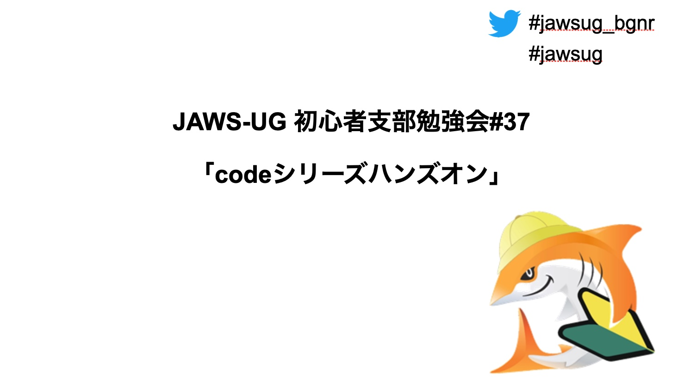

## ちょっと緊張した司会  
前回プッツンプッツンだったNWはとりあえずなんとかなり、画面のテストをしてみると「ノートの部分が表示されてる」とのこと・・・。
ワイドディスプレイでやると全画面表示にしてもこんなふうに映るんですね、初めて知りました。  
colab一周忌のLTのときにノートが表示された理由が今やっと理解できました（別のディスプレイに表示させて終わらせましたが）
  
## 亀田さんのLT  
前回もっと聞きたかったKTの続きということでスタートしました。AWSの中の人でも、サービスがパブリックになった時点で公開されるのはちょっと意外でした。
Lambdaがリリースされた時はその凄さがまだ浸透していなかったとのこと。今でこそサーバレスの代表と言ってもいいレベルですが、最初からもてはやされたわけではないんですねw  
バッチ処理、という意味を再確認するという部分に皆さん反応しておりましたね。

Cloudfrontの課金形態はGB単位、しかも単位のbitとbyteが当時はごっちゃになっていたみたいで、見積もり時に8倍の値段で出してしまっていたとのこと。。。  
当時の計算エクセルシートがお土産に配られました。

SAAの勉強でしか聞かなかった[インスタンスストア](https://docs.aws.amazon.com/ja_jp/AWSEC2/latest/UserGuide/InstanceStorage.html)ですが、使いやすくなったそうなので、是非使ってほしいとのことでした（SAAの試験に関する部分ももにょもにょと言ってましたw）

  
## 織田さんのハンズオン  
Code 〇〇シリーズを触るどころか、初めて名前を聞くものもありました。Pipelineは知ってますが、他はナニソレ状態です。
前半はCodestarによる構築、後半は手動で全部やるという２段階の内容でした。  
  
Codestar,すごいですね。。。インスタンスどころか、S3やIAMのアクセス権等などを待っているだけで全部作り上げてくれるんですか。  
Cloudformationよりも多くのことができそうだなと感じました。
  
この手順書は同じく初心者支部の武田さんがJAWS DAYSで使っていた[claat](https://zenn.dev/taketakekaho/articles/6e9483bc984243)を使用しておりました。  
これ便利ですね。
  
## 興味のあるサービスで食いついてくれた人も？  
JAWSの勉強会では好きなAWSサービスを紹介するのが常？ですが、今回は興味のあるサービスということで[AWS Systems Manager](https://aws.amazon.com/jp/systems-manager/)をあげさせていただきました。  
[Incident Manage](https://aws.amazon.com/jp/blogs/news/resolve-it-incidents-faster-with-incident-manager-a-new-capability-of-aws-systems-manager/)という運用が好きそうなサービスがリリースされていましたので。  

[こんなのを](https://twitter.com/ad_motsu/status/1391958324099223554)つぶやいたら執筆者ご本人からリプがくるとは夢にも思っておりませんでしたが・・・。  
ちなみにITILに完全準拠しているわけではないのですが、対応できるとのことです。
  
##  まとめ：ハンズオンは自身も勉強になるからいいですね
触ったことがないシリーズをまとめて触るきっかけはなかなかないので、今回のハンズオンが自身がすごく勉強になりました。  
ハンズオンは作ると結構ちゃんと勉強しないといけなくなるので、やってみたほうがいいという話になっていました。  